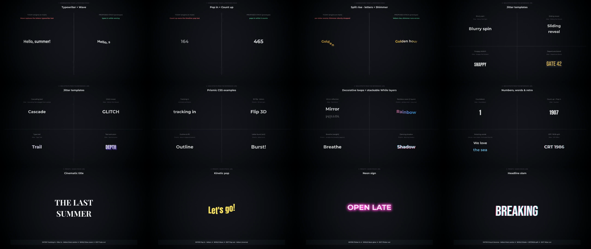

# Text motion references: integration advice, a GUI that scales, stackable effects

Date: 2026-09-25 · Status: **advisory + working prototype**. Five combination
bugs found during the audit are **fixed on this branch** (with tests); the
architecture and GUI below are proposals awaiting decisions (see the end).

Request (improvements.md, 2026-09-23): *"check the below references and advise
if we can integrate the text motion in the application. also propose better gui
(align with transitions gui) as number of text effects increase. so show
examples, but also makes sure text effects can be combined"*. References:
[Jitter text templates](https://jitter.video/templates/text/),
[Easy Text Effects for Unity](https://github.com/LeiQiaoZhi/Easy-Text-Effects-for-Unity),
[Prismic: CSS text animations](https://prismic.io/blog/css-text-animations),
[GitHub topic text-animations](https://github.com/topics/text-animations?o=desc&s=stars).

Format as in the other docs: options are marked **[recommended]** / alternative.

## TL;DR

1. **Yes, integrate the motion, not the code.** None of the references can be
   embedded: Jitter is a closed web app, Easy Text Effects is Unity/C#, and the
   CSS examples and GitHub libraries need a browser DOM. The MP4 is rendered
   by FFmpeg/libass and must match the editor (the WYSIWYG rule from
   [text-effects-options.md](text-effects-options.md)). Re-expressed for libass,
   **28 of the 42 effects reviewed (Jitter + Prismic) are exact, 7 are close
   approximations, and 7 are not possible**: blend modes, shape morphing,
   chat-bubble UI, image-filled text, holographic blends, colour fonts and
   hover-only effects.
2. **Combining effects is the real problem today, not the effect count.** The
   engine allows 1 enter + 1 while + 1 exit (+ separate toggles) and
   concatenates libass tags. Those tags fight: libass keeps only the first
   `\fad`/`\pos`/`\move`, absolute tags overwrite each other, several
   effects rewrite the text body, and tags are copied unchanged into time
   slices. The audit (§4) found **5 timing bugs, fixed here**, and
   **7 structural limits** that need the new architecture.
3. **Proposal: an effect *stack* + a channel *compositor*** (§5). Each lane
   (Enter / While shown / Exit) holds any number of layers. Every effect is
   declarative data (keyframes per channel), and layers are *composed per
   channel*: opacity ×, scale ×, offsets +, rotations +, colour in stack
   order, clip ∩. So "Typewriter + Wave", "Pop in · words + Wave · letters",
   "Slide + motion path" all work. There is **one** exclusive rule: only one
   effect per phase may rewrite the text itself (scramble, counters). It is
   shown in the GUI, never silent.
4. **One registry, two engines**: Python compiles to ASS for the MP4, a
   JavaScript twin drives the live preview. The prototype proves they agree:
   7,777 unit-frames compared, max difference 1e-13, identical scrambled
   glyphs. The preview stops being an approximation.
5. **GUI (§6):** the text effect picker grows into the transition browser's
   anatomy (search, tabs, category rail with counts, tiles, **★ favourites,
   Recent, Presets, full gallery**), plus **lanes with layer rows**, **hover
   = preview on top of the current stack**, a **mini timeline** and
   **presets = saved stacks**. The separate toggles (grow/shrink, rotate,
   squash, colour change, bouncy, motion path) become While layers.

**Examples (all real):**

| What | Where |
|---|---|
| Rendered demo, libass, 71.6 s, 1.05 MB: ① today vs stack side by side, ② 20 new effects from the references, ③ 6 presets | `docs/demo/text-motion-stack-demo.mp4`, poster `docs/demo/text-motion-stack-poster.png` |
| Interactive GUI mock-up (live preview = JS twin engine) | `docs/mockups/text-effects-stack.html` (serve the repo root: `python3 -m http.server`, open `/docs/mockups/text-effects-stack.html`) |
| Prototype compositor (Python → ASS) + registry v2 prototype (53 effects) | `docs/demo/text_motion_stack.py`, `docs/demo/text-motion-effects.json` |
| Twin-engine golden test (Python vs JS) | `docs/demo/check_twin_engines.py` |



---

## 1. Fixed on this branch (backend, with tests)

All in `backend/app/text_effects.py`. Tests: `backend/tests/test_text_effects.py`
(`FadeMergeTests`, `SlicedTimingTests`, `HiddenLineTests`, +12 tests; suite
401 → 413 OK). Each new test was also run against `main`'s engine, where it
fails, and two of them render with the real libass and measure brightness.

| # | Symptom on `main` (verified) | Cause | Fix |
|---|---|---|---|
| 1 | **Exit fade lost**: the text stays 100 % visible and pops off on the last frame. Default Fade + Fade out with any libass While (Neon glow, Pulse, Wave, Shimmer, Slow zoom, Colour cycle, …), a slide enter + move exit, and **every caption on an FFmpeg without drawtext**. 1,120 of 12,672 enter×while×exit combinations (9 %). | libass honours only the **first** `\fad` of an event; enter and exit each emitted one (`\fad(800,0)\fad(0,600)`). | `_merge_fades()` in `_ev()`: one `\fad(max in, max out)`. |
| 2 | **Typewriter + caret / Decrypted scramble look dim and flicker for the whole reveal** (measured ~15 % brightness mid-typing) with the default Fade out. | Every 120 ms typing step carried the 500–600 ms exit `\fad`, which counts from each step's own end. | Only the final step carries the exit. |
| 3 | **Text fades out, then pops back to be deleted**: Wipe/Zoom/Pop … + Typewriter delete / Scramble out (10 % brightness just before the delete). Fix 1 would have extended this to Fade enters, so it had to be fixed too. | The body event ends where the delete starts but still got the exit fade. | Sliced exits: the body gets no exit tags (the tail performs the exit). |
| 4 | **Loops restart in every slice**: motion path (circle, sine, eased) + Pulse/Neon glow/any loop, and Typewriter + caret + loop, show no pulse (restart every 78–120 ms). Pop out/Blur out/Wipe out on typing steps never played. | `\t`/`\move` times count from each event's start; window-timed tags were copied unchanged into later slices. | `_shift_tag_times()` re-times loops, inline body tags and exits per slice (negative times = already elapsed in libass). |
| 5 | **Split rise · chars / Split from centre draw every remaining letter in every event**: ghost copies of "olden hour", "lden hour", … rise on top of each other, and the text is over-drawn at rest. | `_hidden_line_text()` never re-hid the text after the visible unit. | Re-hide after the unit. |

Not changed, but recommended (decision 3): the ASS header has no `Kerning: yes`,
so **libass renders every caption without kerning** (VSFilter-compatible
default), while the CSS preview and HarfBuzz-shaped drawtext do kern. The same
caption is spaced differently in the editor, in drawtext and in libass.
Verified with per-letter pixel measurements (up to 5 px drift across "AVATAR
Toy" at 72 px).

## 2. The references: what they are and what we can take

### 2.1 Jitter: text templates

A browser motion-design tool. Its templates are compositions of property
animations on text layers. The text animation settings are exactly the model
we need: **apply to letter / word / line / whole text, order (first → last,
reverse), delay between units, smoothing**, custom In/Out effects built from
**move X/Y, rotate, scale, opacity, colour, blur radius, clipping mask,
acceleration**, easing presets (slow down, accelerate, elastic, bounce,
overshoot + intensity), reusable custom effects. Exports are GIF/MP4/MOV/WebM
and Lottie, and the Lottie export replaces text animations with fades, so
**importing Jitter animations is a dead end**; re-expressing them is not.

| Template | libass mapping | Verdict | In demo |
|---|---|---|---|
| Blurry Text Spin | per word: `\blur` + `\fry` + scale | exact | ✓ |
| Sliding Text Reveal | per line: fixed `\clip` mask + y slide | exact | ✓ |
| Snappy Text Stretch | per letter: `\fscx`/`\fscy` overshoot | exact | ✓ |
| Departures Board | per letter: glyph flips + squash + drawn tiles (`\p1`) | exact | ✓ |
| Cascading Text | per letter drop, stagger from the centre, bounce easing | exact | ✓ |
| Glitchy Text Reveal | per letter flicker + jitter + RGB copies | exact | ✓ |
| Type Trail | time-delayed tinted copies | exact | ✓ |
| Text Extrusion | stacked offset copies | exact | ✓ |
| Counter / Countdown | content channel (+ pop per tick) | exact | ✓ |
| Bouncy Words, Tilted Text Snap, Elastic Text, Text Scramble, Squeeze | channels per word/letter | exact | registry |
| Stretched Type Repeater, Looped (marquee) text | copies / clip + x loop | exact | later |
| Text Mirror Effect | flipped copy (`\frx180`), uniform alpha + blur (no gradient fade) | ≈ | ✓ |
| CRT Effect | RGB split + flicker + skew; scanlines need a drawing overlay | ≈ | ✓ |
| Motion Blur | ghost copies (libass blur is not directional) | ≈ | later |
| Blend Modes, Morph, Animated Text Messages | blend compositing / shape interpolation / chat UI | ✗ | – |

### 2.2 Easy Text Effects for Unity (MIT, 1.1k★)

C# for TextMeshPro, so there's no code to reuse. It's the closest *model*
though, and it validates the proposal:

| Easy Text Effects concept | Proposal |
|---|---|
| Effects per channel (colour, move, rotate, scale) | channel tracks in registry v2 |
| Composite effects | the stack (+ presets) |
| Duration per char, time between chars, reverse order | `duration`, `stagger`, `order` per layer |
| One time / ping-pong / loop | `loop` for While layers |
| Entry → exit chaining | Enter / While / Exit lanes |
| Tagged ranges (`<link=a+b>` applies effects to part of the text) | later: target a word/range ("emphasis") |
| Per-vertex effects (fold, stretch, slide) | ≈ with `\fax`/`\fay` shear + `\frx`/`\fry`; no free vertex warps |
| Colour gradient per character | ≈ per-letter colours (Rainbow wave) |

### 2.3 Prismic: CSS text animations (40 examples)

Browser-only CSS, used as a catalogue of ideas with a technique mapping:

| Example | libass mapping | Verdict | In demo |
|---|---|---|---|
| Typewriter + caret, neon glow, glitch, wavy text, heartbeat, shadow paint (= Shimmer) | exist today | exact | – |
| Letter burst | per letter random x/y/rotation + fade | exact | ✓ |
| 3D text spin / flip | `\frx` / `\fry` (libass has real 3D rotation) | exact | ✓ |
| Dancing shadow | orbiting coloured copies | exact | ✓ |
| Tracking in (Animista) | animated `\fsp` / letter offsets | exact | ✓ |
| Split text halves | two clipped copies moving apart | exact | later |
| Rainbow / gradient text | per-letter colours (a true gradient needs clip strips) | ≈ | ✓ |
| Variable-font breathe / draw-in | outline in the fill colour; outline → fill | ≈ | ✓ |
| Melting text | blur + drop (no drip shapes) | ≈ | – |
| Image/video-filled text, holographic blends | per-caption alpha-merge / blend in FFmpeg | ✗ (heavy) | – |
| Colour fonts (Nabla) | libass draws monochrome outlines | ✗ | – |
| Hover / scroll triggered | no interaction in a video (their motion is reusable) | ✗ | – |

### 2.4 GitHub topic `text-animations`

The plural topic linked has only **21 small repos**. The singular
[`text-animation`](https://github.com/topics/text-animation?o=desc&s=stars)
(217 repos) holds the relevant libraries: TypeIt (3.2k★, typewriter), tegaki
(3.1k★, handwriting), Animated-Text-Kit (Flutter, 1.8k★), Easy Text Effects
(1.1k★), AnimateText (SwiftUI, 431★), cssanimation (322★). All need their own
runtime (DOM, Flutter, SwiftUI), so none can be embedded. What they share, and
what we adopt, is: **split into letters/words/lines + stagger** (from start,
centre, edges or random), typewriter with caret + delete, scramble, rotating
words, spring/elastic easing. AnimateText's API is literally "one effect
modifier per unit, delayed by index". Handwriting (tegaki) needs stroke-order
data, so ✗; *Outline → fill* is the approximation.

### 2.5 How to integrate: options

- **A. Re-express the motion natively [recommended].** Declarative registry +
  compositor → libass. Exact MP4, fast (libass is already in the build),
  existing fonts, and an exact twin preview. That's what the prototype does.
- **B. Browser-rendered text layer (alternative).** Render captions in
  headless Chromium with the CSS/JS libraries as-is, overlay a transparent
  PNG/WebM sequence in FFmpeg. Any web effect would work, but it adds ~300 MB
  of Chromium to the image and slow renders on the DS918+'s Celeron, needs an
  alpha-video pipeline, and brings font/timing sync problems.
  **Not recommended** (the same reasoning rejected React Bits in the earlier
  doc).
- **C. Lottie import.** Jitter's Lottie export drops text animations. Useful
  only for decorative overlays, out of scope.
- **D. Keep adding single effects to today's three slots.** Cheap per effect,
  but combinations keep breaking (§4). **Not recommended** beyond the fixes.

## 3. Rendered proof (docs/demo)

`make_text_motion_stack_demo.py` renders `text-motion-stack-demo.mp4`
(1280×720, 25 fps, 71.6 s, 1.05 MB; 5,028 ASS events, compiled in ~1.4 s and
rendered in ~30 s including x264 here). Every frame is libass:

1. **Combinations: today vs proposed stack.** The left half is the app's
   *current* engine (imported from `backend/app`, this branch), the right half
   the prototype with the same effects stacked: Typewriter + Wave
   (typewriter lost), Slide from left + motion path (slide becomes a fade),
   Rotate toggle + Typewriter + caret (rotation dropped), Pop in + Count up
   (pop lost), Split rise + Shimmer (shimmer silently dropped). The 2 px
   backend drop shadow is removed on both sides so only effects differ.
2. **20 new effects from the references**, four per screen, labelled with their
   source (Jitter, Prismic, GitHub).
3. **Presets = saved stacks:** Cinematic title (Tracking in + Blur in · letters
   from centre + Slow zoom + Fade out), Kinetic pop, Neon sign, Memo
   typewriter, Headline slam (Drop & bounce · letters + Shake + CRT/RGB split
   + Wipe out), Lower third (two lines).

Measured while building it: *Pop in + Pulse + Pop out* is **not** meaningfully
broken on `main` (overshoot peak 113 % vs 117 %, same pulse afterwards), so it
isn't listed as a failure. The compositor still makes it exact, because scales
multiply.

## 4. Can effects be combined? Audit

Verified with the engine (tag output) and with real libass renders.

**Fixed on this branch:** the five timing bugs in §1.

**Structural limits (need the stack architecture):**

| Combination | On `main` / this branch | Why |
|---|---|---|
| Typewriter (or Split fade · letters) + Wave / Shimmer | the enter is lost | both rewrite the text body |
| Typewriter + Karaoke sweep | the karaoke is lost | two `\k` streams cannot stack |
| Split rise / Split from centre + Wave / Shimmer | the While effect is silently dropped | per-letter events ignore body-based loops |
| Typewriter + Split out · letters | typewriter lost | body conflict |
| Any enter/exit + Shake / Glitch flicker / Count up / Bouncy | enter/exit demoted to fades (Pop in + Count up: pop lost) | the While effect owns the timeline |
| Slide (any `\move` enter) + motion path | the slide becomes a fade | one position per event |
| Rotate / Squash toggle + any libass effect; Colour change + Rotate | rotation dropped (log warning) | the transforms only exist on the drawtext path, although libass has `\frz`/`\fax` |
| Two effects in one slot (e.g. Blur in **and** Tracking in) | impossible | one effect per slot |
| Preview of any combination | differs from the render | the CSS preview nests spans (multiplies), the render concatenates tags; per-letter families preview as a generic staggered fade |

**After the proposal:** every combination above composes. The only rule left
is that **one text-rewriting effect per phase** wins (Decrypt scramble vs
Departures board). A whole-text rewrite (Count up) runs per-letter layers on
the whole text instead. Both cases are reported: an amber badge on the layer,
a warning line, and a flag on the tile before adding.

## 5. Proposed architecture: effect stack + channel compositor

### 5.1 Data model

```ts
// MediaItem.textFx: saved in item_json / payload_json (lossless, no SQL migration)
type TextFxLayer = {
  id: string                                        // stable key (React, drag & drop)
  effect: string                                    // registry id; labels are display only
  unit?: 'text' | 'line' | 'word' | 'char'          // overrides the effect default
  duration?: number                                 // s per unit (Enter/Exit) or loop period
  delay?: number                                    // offset inside the phase
  stagger?: number                                  // s between units / phase offset for loops
  order?: 'forward' | 'reverse' | 'center' | 'edges' | 'random'
  loop?: 'loop' | 'pingpong' | 'once'               // While layers
  intensity?: number                                // 0–2, scales every deviation from neutral
  params?: Record<string, string | number>          // colours, from/to, path points …
  muted?: boolean                                   // kept, skipped in preview and render
}
```

The phase comes from the effect. Order inside a lane matters only for colour
(the top layer wins). **Back-compat:** `textFxEnter/While/Exit` map to one layer
each, and `textScale*`, `textRotate*`, `textSquish*`, `textColorAnim*`,
`textBouncy*` and `textMove*` map to While layers (the motion-path canvas editor
stays). A caption without `textFx` renders exactly as today, and the legacy
single fade stays byte-identical on the drawtext path.

### 5.2 Registry v2: effects are data

```json
{ "id": "pop-in", "label": "Pop in", "phase": "in", "category": "Zoom & pop", "unit": "text", "duration": 0.6,
  "tracks": { "opacity": [[0, 0], [0.3, 1]],
              "scale":   [[0, 0.2], [0.62, 1.14, "outCubic"], [1, 1, "inOutSine"]] } }
```

| Channel | Composition | ASS output |
|---|---|---|
| opacity, fill | multiply | `\alpha`, `\1a` |
| scale, sx, sy | multiply | `\fscx`, `\fscy` |
| x, y (em), path (frame %) | add | `\pos` / `\move` (sliced where not linear) |
| rz, rx, ry (°), skew | add | `\frz`, `\frx`, `\fry`, `\fax` |
| blur, spacing, line (em) | add | `\blur`, `\fsp` or letter offsets, `\bord` |
| colour | folded in stack order (`"base"` = colour below) | `\1c` |
| clip | intersected, only while its effect runs | `\clip` |
| glow, depth, rgb, orbit | max | drive the copies |
| copies (glow, trail, extrude, mirror, rgb, shadow, box) | added below the text | extra events on a lower layer |
| content (scramble, flap, count, countdown) | **exclusive per phase** | glyph changes (sliced events) |

Units nest: a word-level layer scales and rotates its letters around the word's
centre, so "Pop in · words" + "Wave · letters" really nest. Generators (`sine`,
`noise`, `flicker`, `path`) and per-unit random keyframes (`{"rand": [a, b]}`)
cover loops, shakes, flickers and bursts; the random numbers are deterministic.

### 5.3 Compiler: Python → ASS

- **Layout** with HarfBuzz (`uharfbuzz`, the shaper inside libass) and
  `Kerning: yes`, verified at **0–1 px per letter** against whole-line libass
  renders (Montserrat, Bebas Neue, Caveat; kerning-heavy text; two lines).
  Without metrics (today's hidden-line trick) units cannot scale or rotate
  around their own centre.
- **Sampling, not tag concatenation:** the composed value of every channel is
  sampled at every frame and written as piecewise-linear `\t` chains,
  simplified within tolerances. Events are only split where libass needs it
  (moving units, because `\move` is linear; changing glyphs). So any easing
  (elastic, bounce, overshoot) survives, and first-wins tags can never
  collide.
- **Cost:** the demo's worst caption (per-letter drop + text-wide shake + RGB
  copies) is ~2,300 events for 4 s, easy for libass. An obvious optimisation
  later is merging units whose channels are identical.

### 5.4 Preview: the TypeScript twin

`docs/mockups/text-motion-core.js` interprets the same JSON with the same maths
and the same pseudo-random numbers. `check_twin_engines.py` runs 10 stacks
covering every channel type through both engines on the same layout: **7,777
unit-frames, max |diff| 1.1e-13**. In the app this becomes `src/textMotion.ts`
+ `backend/app/text_motion.py` with the golden test in CI, and it replaces
`TextFxPreview`'s hand-written CSS keyframes.

## 6. GUI proposal (aligned with the transitions GUI)

**Today:** transitions have a chip → popover browser (search, tabs, category
rail with counts, cached tiles, ★ favourites, Recent, scopes, *Open full
gallery* → `TransitionGallery`, randomize with scope). The text picker already
reuses the `transition-browser` classes, but it has **no ★/Recent/full gallery**,
holds **one effect per slot**, and the toggles live in six separate sections of
the editor.

**Proposed (working mock-up: `docs/mockups/text-effects-stack.html`):**

```
TEXT ANIMATION                                    [★ Kinetic pop   PRESET] [Save]
┌ ● ENTER  1 ─────────────────────────────────────────────────────── 0.63 s ┐
│ ⋮⋮ ⊕ Pop in        Zoom & pop        Letter   0.60 s   ⚙  ◉  ✕          │
│ [+ Add enter effect]                                                    │
├ ● WHILE SHOWN  2 ──────────────────────────────────────── whole window ┤
│ ⋮⋮ Aa Wave          Letters & words   Letter   ↻ 1.40 s  ⚙  ◉  ✕          │
│ ⋮⋮ ✦ Neon glow      Light & colour    Text     ↻ 1.80 s  ⚙  ◉  ✕          │
│ [+ Add loop effect]                                                     │
├ ● EXIT  1 ──────────────────────────────────────────────────────── 0.71 s ┤
│ ⋮⋮ ⊕ Pop out       Zoom & pop        Letter   0.50 s   ⚙  ◉  ✕          │
│ [+ Add exit effect]                                                     │
└─────────────────────────────────────────────────────────────────────────┘
 ⚙ expands: Unit · Duration per unit · Stagger · Order · Delay · Intensity · effect params
 ⚠ conflicts show here and as a badge on the layer ("replaced by Decrypt scramble")

 Effect browser (same anatomy as the transition browser):
 [ADD TO WHILE SHOWN] [⌕ Search effects, sources…                          ] [✕]
 (All 52) (Enter 26) (While shown 15) (Exit 11) (★ 3) (Recent 2) (Presets 10)
 ┌──────────────┬────────────────────────────────────────────────────────────┐
 │ All       15 │ LIGHT & COLOUR                                             │
 │ ✦ Light    6 │ [tile] [tile] [tile]  tile = live clip · unit badge (CH/W/T)│
 │ ∿ Motion   3 │                       · ≈ approximation · conflict flag     │
 │ ▚ Glitch   2 │                       ("replaces Typewriter") · ☆ favourite │
 └──────────────┴────────────────────────────────────────────────────────────┘
  15 effects · all stackable                 [ ] Autoplay tiles  [Open full gallery ⤢]

 Preview stage + mini timeline (drag a bar's inner edge = duration, click = seek):
 ENTER        ▇▇▇▇▇▇▇
 WHILE SHOWN  ▇▇▇▇▇▇▇▇▇▇▇▇▇▇▇▇▇▇▇▇▇▇▇▇▇▇▇▇▇▇▇▇▇▇▇▇▇▇▇▇▇▇▇▇▇▇
 EXIT                                                ▇▇▇▇▇▇▇
```

Behaviour:

1. **Hover a tile = preview it on top of the current stack.** This is the key
   to combining without trial renders. Click adds it to the lane; clicking a
   layer's name opens the browser in *swap* mode (same phase only).
2. **★ favourites, Recent, Presets tabs**, as for transitions. Tiles keep the
   cached example clips (existing infra) and gain badges for unit,
   approximation and conflicts.
3. **Full gallery** (`TextEffectGallery`, mirror of `TransitionGallery`): big
   stage with the user's own caption and stack, a details panel (what it
   animates, how it combines, exact vs ≈), and *Add to Enter/While/Exit*.
4. **Presets ("Looks")**: curated stacks plus *Save as preset* (per browser
   like favourites first). **Randomize** picks presets, so random always looks
   intentional.
5. **Toggles become While layers**: Grow/Shrink, Rotate, Squash, Colour change,
   Bouncy, Motion path (its canvas editor stays). This also settles the open
   improvements.md item about the duplicate *Bouncy text*.
6. **Storyline / detailed list chips** keep their size: first symbol + **+N**,
   and the tooltip lists the stack.
7. **It scales like transitions:** 50 → 200+ effects stay findable through
   search, categories with counts, ★ and Recent, while the lanes keep the
   editor compact.

## 7. Catalogue additions (prototype registry)

The prototype registry has 53 effects: 31 existing effects/toggles re-expressed
as channel data (production keeps the app's labels) and **22 new ones from the
references**: Blurry spin, Sliding reveal, Snappy stretch, Tracking in, 3D flip ·
letters, Cascade drop, Departures board, Glitch reveal, Type trail, Text
extrusion, Outline → fill, Drop & bounce · words, Tilted snap, Elastic letters,
Rainbow wave, Breathe (weight), Dancing shadow, Mirror reflection, CRT / RGB
split, Countdown, Slide out of mask, Letter burst. Next candidates: Squeeze,
Split halves, Motion blur, Marquee, Type repeater, rotating words as one
effect (the demo builds it from captions), word-range targeting.

## 8. Phasing

| Phase | Content | Size |
|---|---|---|
| P0 (done) | five timing fixes + tests; prototype, demo, mock-up, twin check | – |
| P1 | registry v2 + `backend/app/text_motion.py` behind a flag; convert the 72 effects; golden tests; `uharfbuzz`; `Kerning: yes`; drawtext legacy path untouched | M |
| P2 | `textFx` data model + legacy mapping; `src/textMotion.ts` preview replacing `TextFxPreview` | M |
| P3 | lanes + browser (★/Recent/Presets) + conflict badges; toggles → While layers; storyline chips; randomize presets | M–L |
| P4 | full gallery, mini timeline, saved presets; new effects batch 1 (Jitter), batch 2 (Prismic/copies); word-range targeting | M |

## 9. Decisions needed

1. **Architecture:** A: stack + compositor + declarative registry **[recommended]**;
   D: keep single slots and patch.
2. **Letter metrics:** add `uharfbuzz` + `fontTools` to the backend image
   (small wheels, same shaper as libass) **[recommended]**; alternative:
   approximate widths (units can't rotate/scale around their own centre).
3. **`Kerning: yes`** for all libass text **[recommended]**: matches preview
   and drawtext, but slightly changes spacing of existing renders.
4. **Store effect ids** in `textFx` **[recommended]**; alternative: labels
   (current convention, rename-fragile).
5. **Legacy fields:** migrate on load, write `textFx` only **[recommended]**;
   alternative: write both for one release.
6. **Preview:** replace the CSS approximation with the TS twin **[recommended]**.
7. **GUI:** lanes + aligned browser + hover-preview + presets now, full gallery
   and mini timeline in P4 **[recommended]**; alternative: everything at once.
8. **Toggles → While layers**, removing the duplicate *Bouncy text* **[recommended]**.
9. **First new effects:** the Jitter batch **[recommended]**, or pick from §7.
10. **Presets storage:** per browser first (like favourites) **[recommended]**;
    project or global later.

## Appendix: reproduce

```bash
python3 -m venv ~/.venv && . ~/.venv/bin/activate
pip install -r backend/requirements.txt uharfbuzz fonttools imageio-ffmpeg
cd backend && python -m unittest discover -s tests && cd ..         # 413 OK
python3 docs/demo/make_text_motion_stack_demo.py                    # MP4 + poster (FFmpeg with libass)
python3 docs/demo/check_twin_engines.py                             # Python vs JS (needs node)
python3 -m http.server 8000   # then open /docs/mockups/text-effects-stack.html
```
